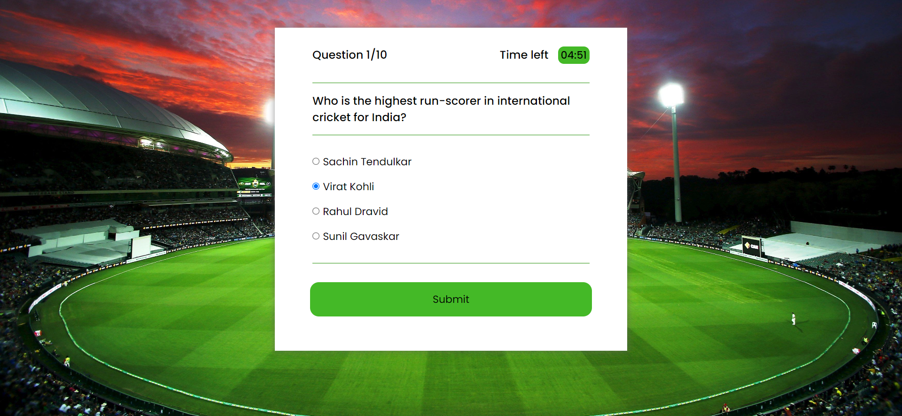

# Quiz App

This repository contains the code for a quiz app project built using JavaScript. The quiz app focuses on cricket-related questions and aims to test users' knowledge of the sport within the time of 5 minutes. It provides an interactive and engaging experience for users to participate in the quiz and evaluate their cricket knowledge.

## Features

- Displaying the timeleft.
- Keep track of the user's score throughout the quiz.
- Display the final score at the end of the quiz.
- Allow users to restart the quiz to play again.

## Technologies Used

The project is primarily built using the following technologies:

- JavaScript: Used to handle the logic and functionality of the quiz.
- HTML: Provides the structure and layout for the quiz app.
- CSS: Used to style the quiz app and make it visually appealing.

## Website Preview

